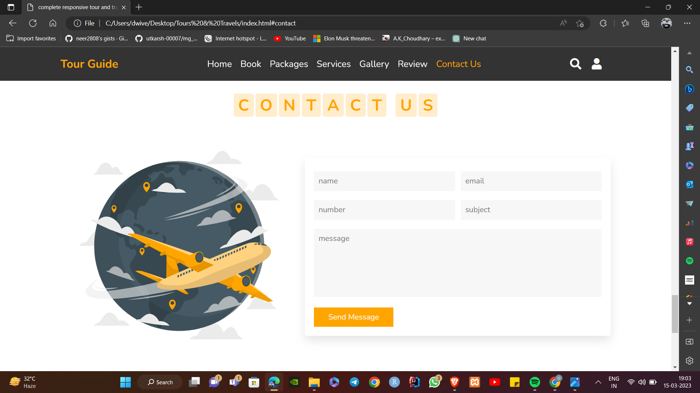

 

<h1> Tour & Travels </h1>
    
 

 &nbsp; &nbsp; 

  
# Technologies Used 
---
[<kbd>   HTML 5   </kbd>][html]&nbsp;&nbsp;
[<kbd>   CSS 3   </kbd>][css]&nbsp;&nbsp;
[<kbd>   JavaScript ES6   </kbd>][js]&nbsp;&nbsp;

---

 

# Application UI
 &nbsp; &nbsp;  &nbsp; &nbsp;    &nbsp; &nbsp;      &nbsp; &nbsp; 
  &nbsp; &nbsp;   &nbsp; &nbsp;       &nbsp; &nbsp;  &nbsp; &nbsp;  &nbsp; &nbsp;      &nbsp; &nbsp;    &nbsp; &nbsp; &nbsp; &nbsp;    &nbsp; &nbsp; 

 

# Contributors:

<!-----------------------------{ technologies used }---------------------------->

[html]: https://developer.mozilla.org/en-US/docs/Web/HTML
[css]: https://developer.mozilla.org/en-US/docs/Web/CSS
[js]: https://developer.mozilla.org/en-US/docs/Web/JavaScript
